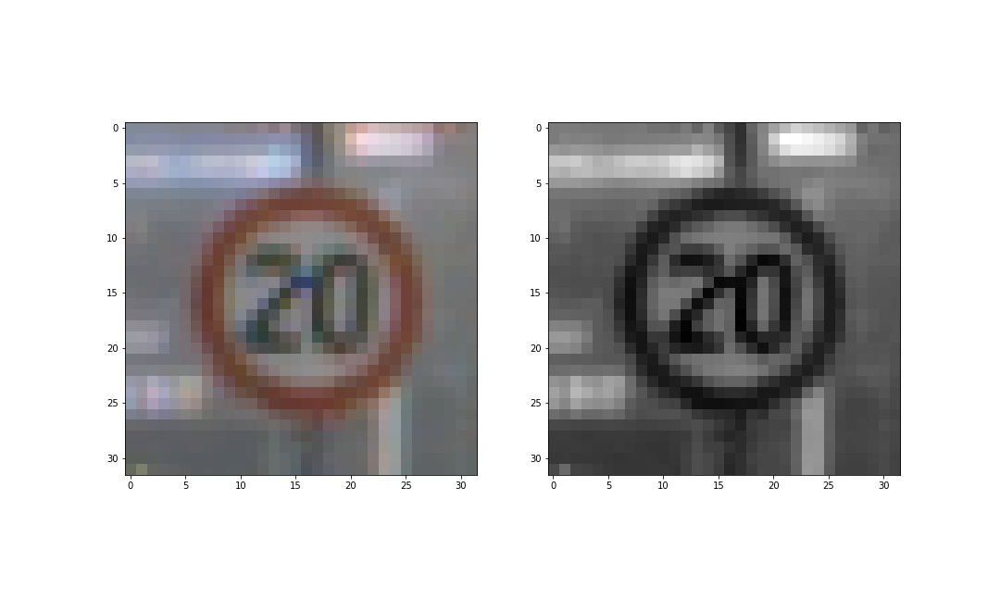

# **Traffic Sign Recognition** 

---

**Build a Traffic Sign Recognition Project**

The goals / steps of this project are the following:
* Load the data set (see below for links to the project data set)
* Explore, summarize and visualize the data set
* Design, train and test a model architecture
* Use the model to make predictions on new images
* Analyze the softmax probabilities of the new images
* Summarize the results with a written report

## Rubric Points
### Here I will consider the [rubric points](https://review.udacity.com/#!/rubrics/481/view) individually and describe how I addressed each point in my implementation.  

---
### Writeup / README

#### 1. Provide a Writeup / README that includes all the rubric points and how you addressed each one. You can submit your writeup as markdown or pdf. You can use this template as a guide for writing the report. The submission includes the project code.

You're reading it! and here is a link to my [project code] ?????????????

### Data Set Summary & Exploration

#### 1. Provide a basic summary of the data set. In the code, the analysis should be done using python, numpy and/or pandas methods rather than hardcoding results manually.

I used the numpy library to calculate summary statistics of the traffic
signs data set:

* The size of training set is 34799
* The size of the validation set is 12630
* The size of test set is 4410
* The shape of a traffic sign image is (32 * 32)
* The number of unique classes/labels in the data set is 43

#### 2. Include an exploratory visualization of the dataset.

The following bar chart shows the the representative number of each classes/labels in each data set:

### Design and Test a Model Architecture

#### 1. Describe how you preprocessed the image data. What techniques were chosen and why did you choose these techniques? Consider including images showing the output of each preprocessing technique. Pre-processing refers to techniques such as converting to grayscale, normalization, etc. (OPTIONAL: As described in the "Stand Out Suggestions" part of the rubric, if you generated additional data for training, describe why you decided to generate additional data, how you generated the data, and provide example images of the additional data. Then describe the characteristics of the augmented training set like number of images in the set, number of images for each class, etc.)

I decided to generate additional data because, some of the classes had just few samples compared to others. For those classes, I generated pictures with data augmentation techniques from the python library `imgaug`: rotation, translation, shearing, zooming in and out, gaussian bluring and gaussian noise.

The difference between the original data set and the augmented data set is the following `51838 - 34799 = 17039` 

The sample representation of each set before and after data augmentation is shown below:

An example of data augmentation is shown below:

The first step of preprocessing was converting the images to grayscale, since informations about the traffic sign is more related to the geometry inside it

Here is an example of a traffic sign image before and after grayscaling.

As a last step, I normalized the image data because, I want my data to be normally distributed around a mean of 0 in order to get a faster convergence of the neural network 

#### 2. Describe what your final model architecture looks like including model type, layers, layer sizes, connectivity, etc.) Consider including a diagram and/or table describing the final model.

My final model consisted of the following layers:

| Layer         		|     Description	        					| 
|:---------------------:|:---------------------------------------------:| 
| Input         		| 32x32x1 Grayscale image   					| 
| Convolution 3x3    	| 1x1 stride, valid padding, outputs 30x30x20 	|
| RELU					|												|
| Convolution 3x3    	| 1x1 stride, valid padding, outputs 28x28x40 	|
| RELU					|												|
| Max pooling 2x2       | 2x2 stride,  outputs 14x14x40 				|
| Convolution 5x5    	| 1x1 stride, valid padding, outputs 10x10x60 	|
| RELU					|												|
| Max pooling 2x2      	| 2x2 stride,  outputs 5x5x60 				    |
| Dropout           	| Keep probability 0.5 				    |
| Fully connection 1500	| outputs 500  									|
| RELU					|												|
| Fully connection 500	| outputs 250  									|
| RELU					|												|
| Fully connection 250	| outputs 43  									|

#### 3. Describe how you trained your model. The discussion can include the type of optimizer, the batch size, number of epochs and any hyperparameters such as learning rate.

To train the model, I used the following:
* Batch size of 128
* Number of epochs of 30
* Learning rate of 0.001
* L2 regularization with a factor of 0.001
* Adam optimizer to update the weights

#### 4. Describe the approach taken for finding a solution and getting the validation set accuracy to be at least 0.93. Include in the discussion the results on the training, validation and test sets and where in the code these were calculated. Your approach may have been an iterative process, in which case, outline the steps you took to get to the final solution and why you chose those steps. Perhaps your solution involved an already well known implementation or architecture. In this case, discuss why you think the architecture is suitable for the current problem.

My final model results were:
* training set accuracy of 99.85%
* validation set accuracy of 97.23% 
* test set accuracy of 96.33%

Iterative approach
- The initial architecture was the Lenet5 networt from Yan Lecun
- Using the augmented set of images lead to similar results of training and validation sets accuracy as the model stopped to train, but both around 70%. From my point of view, there not enough filters to capture the different aspects of the different classes
- Therefore:
    - I adjust the architecture by adding one more layer and more filters on the other layers and also a dropout before the first full connection.
    - I combined the model optimization with the L2 regularization and a smaller learning rate (with an higher number of iteration)
- Adding a dropout helped my model to avoid overfitting (adapt the model to particular features of the images), this improved the accuracy on the test set of 4%.
### Test a Model on New Images

#### 1. Choose five German traffic signs found on the web and provide them in the report. For each image, discuss what quality or qualities might be difficult to classify.

Here are five German traffic signs that I found on the web (above: original images, below resized images to 32x32x3):

 

The first image might be difficult to classify because of the lack of luminosity in the image. The second and fourth images have actually good chances to be guessed right. The third and fifth images might be difficult because of the blurry character of their pixels.

#### 2. Discuss the model's predictions on these new traffic signs and compare the results to predicting on the test set. At a minimum, discuss what the predictions were, the accuracy on these new predictions, and compare the accuracy to the accuracy on the test set (OPTIONAL: Discuss the results in more detail as described in the "Stand Out Suggestions" part of the rubric).

Here are the results of the prediction:

| Image			        |     Prediction	        					| 
|:---------------------:|:---------------------------------------------:| 
| | Right-of-way at the next intersection| 
| | General caution|
| | Turn right ahead|
| | Speed limit (30km/h)|
| | Speed limit (80km/h)|

The model was able to correctly guess 4 of the 5 traffic signs, which gives an accuracy of 80%.

#### 3. Describe how certain the model is when predicting on each of the five new images by looking at the softmax probabilities for each prediction. Provide the top 5 softmax probabilities for each image along with the sign type of each probability. (OPTIONAL: as described in the "Stand Out Suggestions" part of the rubric, visualizations can also be provided such as bar charts)

The code for making predictions on my final model is located in the 11th cell of the Ipython notebook.

For the first image, the model comes with a probability of 0.5 that the sign is *Beware of ice/snow* and 0.3 for *Right-of-way at the next intersection*, which was the right guess. The top five soft max probabilities were:

| Probability         	|     Prediction	        					| 
|:---------------------:|:---------------------------------------------:| 
|0.50                   |                   Beware of ice/snow |
|0.31                   |        Right-of-way at the next intersection|
|0.08                   |                     Bicycles crossing|
|0.03                   |                       Traffic signals|
|0.02                   |                 Wild animals crossing|

For the second image the model is 100% sure for what is the right guess. The top five soft max probabilities were:

| Probability         	|     Prediction	        					| 
|:---------------------:|:---------------------------------------------:| 
|1.00                   |                       General caution|
|0.00                   |                       Traffic signals|
|0.00                   |                           Pedestrians|
|0.00                   |        Right-of-way at the next intersection|
|0.00                   |                           No vehicles|

For the third image the model is 100% sure for what is the right guess. The top five soft max probabilities were:

| Probability         	|     Prediction	        					| 
|:---------------------:|:---------------------------------------------:| 
|1.00                   |                      Turn right ahead|
|0.00                   |                   Go straight or left|
|0.00                   |                            Ahead only|
|0.00                   |                             Keep left|
|0.00                   |                  Go straight or right|

For the fourth image the model is 100% sure for what is the right guess. The top five soft max probabilities were:

| Probability         	|     Prediction	        					| 
|:---------------------:|:---------------------------------------------:| 
|1.00                   |                  Speed limit (30km/h)|
|0.00                   |                 Speed limit (50km/h)|
|0.00                   |                  Speed limit (20km/h)|
|0.00                   |                  Speed limit (70km/h)|
|0.00                   |                  Speed limit (80km/h)|

For the fifth image the model is 100% sure for what is the right guess. The top five soft max probabilities were:

| Probability         	|     Prediction	        					| 
|:---------------------:|:---------------------------------------------:| 
|1.00                   |                  Speed limit (80km/h)|
|0.00                   |                 Speed limit (100km/h)|
|0.00                   |                  Speed limit (30km/h)|
|0.00                   |                  Speed limit (50km/h)|
|0.00                   |                  Speed limit (60km/h)|

### (Optional) Visualizing the Neural Network (See Step 4 of the Ipython notebook for more details)
#### 1. Discuss the visual output of your trained network's feature maps. What characteristics did the neural network use to make classifications?
As seen in the following picture the first layer focused on curvy edges of the sign:

 

